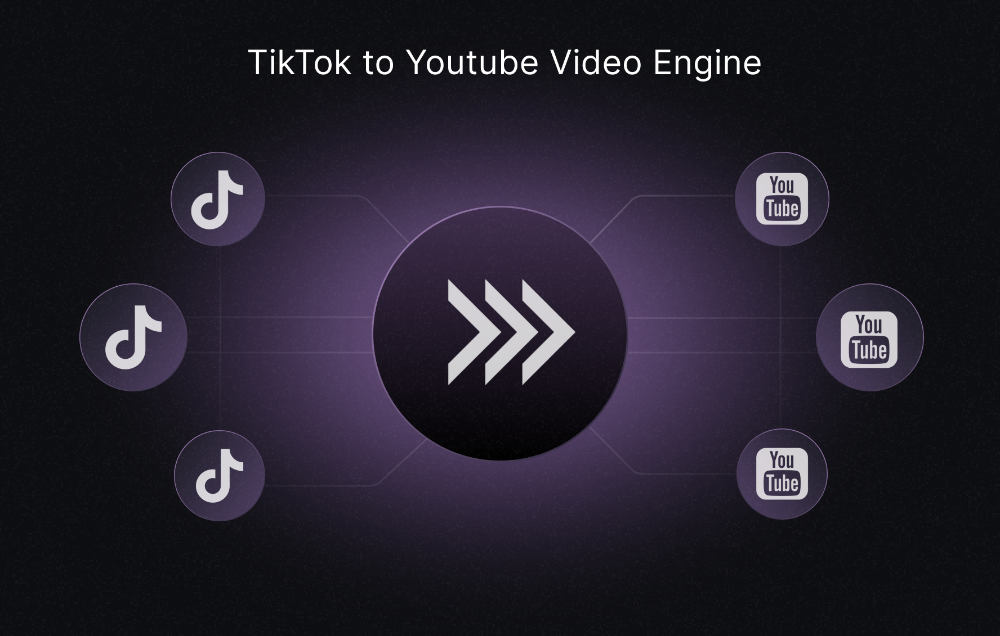

 

<h3 align="center">TikTok to Youtube Video Engine</h3>

  

    Tiktok & Youtube video arbitrage. Generated +1,6 million views and thousands of Youtube subs in a few weeks. 
     
     
    <a href="https://github.com/ntegrals/voice-assistant/issues">Report Bug</a>
    ·
    <a href="https://github.com/ntegrals/voice-assistant/issues">Request Feature</a>
  

## Features

    ✅ Video pipeline that's almost fully automated
    ✅ Gets the trending videos from selected TikTok trends or accounts
    ✅ Works around the TikTok anti-scraping mechanism to scrape and download the videos
    ✅ Generates high quality compilations, titles, descriptions and thumbnails
    ✅ Tested on multiple accounts (The accounts grew to +2.2k subs / +1,6 million views in a few weeks without any promotion)
    ✅ Uploads the videos to Youtube (Experimental)

## Demo

Here are both channels with the videos, thumbnails, descriptions, etc. that were produced with this engine:

Example video:

- https://www.youtube.com/watch?v=t1HDpa5F9eo

Both channels:

- https://www.youtube.com/@diagonalley6185 (1,258,487 views - 1.6k subscribers - 11 videos)
- https://www.youtube.com/@hogwartsletter1875 (352,526 views - 664 subscribers - 11 videos)

The topic selection (Harry Potter in this case) is arbitrary. The engine can be used for any topic and niche.

## Motivation

This was a fun and messy learning project I've built quite a while ago, aiming to automate the process of creating Youtube videos with compilations as the starting point.

Why compilations? Because they are easy to produce and have a high chance of going viral. The downside is that they are not monetizable, as they are not considered original content.

I haven't updated the code in a few years, so the code quality is not the best. I'm still sharing it, as it might be useful for someone who wants to build something similar.

## Why am I not using it anymore?

It was just a fun project to learn about the Youtube algorithm and how to create viral videos. I've learned a lot and it was a great experience, but it doesn't make sense to continue with it, as it's not monetizable. (At least not in it's current form)

## Contact

Hi! Thanks for checking out and using this library. If you are interested in discussing your project, require mentorship, consider hiring me, or just wanna chat - I'm happy to talk.

You can send me an email to get in touch: j.schoen@mail.com or message me on Twitter: [@julianschoen](https://twitter.com/julianschoen)

If you'd just want to give something back, I've got a Buy Me A Coffee account:

Thanks and have an awesome day 👋

## Disclaimer

TikTok to Youtube Video Engine, is an experimental application and is provided "as-is" without any warranty, express or implied. By using this software, you agree to assume all risks associated with its use, including but not limited to data loss, system failure, or any other issues that may arise.

The developers and contributors of this project do not accept any responsibility or liability for any losses, damages, or other consequences that may occur as a result of using this software. You are solely responsible for any decisions and actions taken based on the information provided by TikTok to Youtube Video Engine.

Please note that the use of the GPT-4 language model can be expensive due to its token usage. By utilizing this project, you acknowledge that you are responsible for monitoring and managing your own token usage and the associated costs. It is highly recommended to check your OpenAI API usage regularly and set up any necessary limits or alerts to prevent unexpected charges.

By using TikTok to Youtube Video Engine, you agree to indemnify, defend, and hold harmless the developers, contributors, and any affiliated parties from and against any and all claims, damages, losses, liabilities, costs, and expenses (including reasonable attorneys' fees) arising from your use of this software or your violation of these terms.

<!-- LICENSE -->

## License

Distributed under the MIT License. See `LICENSE` for more information.
